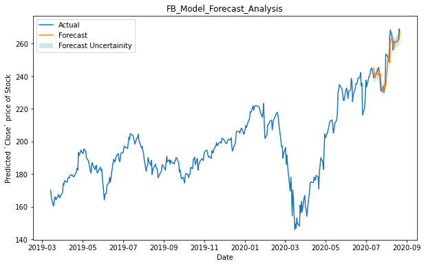
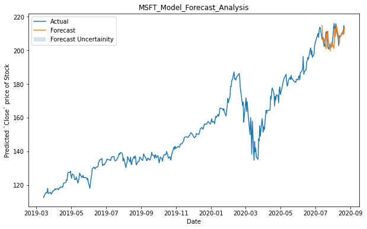
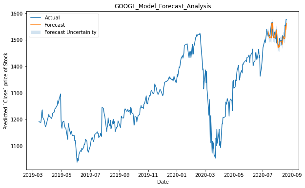

# Stock Price Prediction Model
Stock market prediction is the act of trying to determine the future value of a company stock or other financial instrument traded on an exchange. The successful prediction of a stock's future price could yield significant profit. The efficient-market hypothesis suggests that stock prices reflect all currently available information and any price changes that are not based on newly revealed information thus are inherently unpredictable. Others disagree and those with this viewpoint possess myriad methods and technologies which purportedly allow them to gain future price information.

## Getting Started

### Create a project environment (virtual env):
- pip install virtualenv
- py -m venv env

### Activate the environment
- .\env\Scripts\activate

### Deactivate the environment
- deactivate 

### Install prerequisites:
- pip install -r REQUIREMENTS.txt

### Run Project:
- streamlit run app.py

## Model Validation Analysis
### Facebook (Stock: FB) Validation

### Microsoft (Stock: MSFT) Validation

### Google (Stock: GOOGL) Validation
